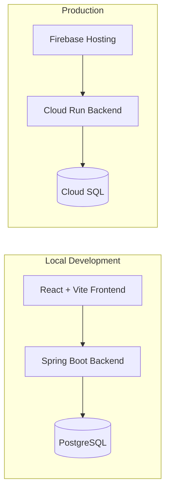

# Waveon

Short description
-----------------  
Waveon is a full-stack music web application consisting of a React + TypeScript frontend and a Spring Boot (Java) backend with PostgreSQL. It supports uploading and streaming audio, user authentication (JWT), user profiles, artists, albums, playlists and song likes. The repository includes Dockerfiles and a docker-compose configuration for easy local development, and deployment instructions for Firebase Hosting (frontend) + Cloud Run + Cloud SQL (backend).

Table of contents
-----------------  
- Quick start (Docker Compose)
- Local development (backend / frontend)
- Build & production
- Environment variables
- Architecture & technologies
- Project structure (important files)
- API overview
- Database & migrations
- Deployment notes (Firebase + Cloud Run)
- Tests & linting
- Troubleshooting & FAQs
- Contributing
- License

Quick start — full stack with Docker Compose
-------------------------------------------  
This is the fastest way to get the whole stack running (frontend + backend + Postgres):

Prerequisites:
- Docker Desktop (and docker-compose)

From the repository root:
1. Build and run:
    - Linux / macOS / Windows (PowerShell):
      ```bash
      docker compose up --build
      ```  
2. After compose completes:
    - Frontend (Vite dev server) mapped to host port 3000
    - Backend mapped to host port 8080
    - Postgres available on port 5432

3. Stop:
   ```bash
   docker compose down
   ```

Notes:
- The backend application serves under the context path `/api`. See `backend/src/main/resources/application.yaml`.
- The docker-compose service names are: `frontend`, `backend`, `db`. The Postgres DB is configured as `waveondb` / `user` / `password` by default.

Local development — backend
---------------------------  
The backend is a Spring Boot application.

Prerequisites:
- JDK 24 (toolchain configured in `build.gradle`)
- Gradle wrapper (included)
- A running PostgreSQL (docker-compose or local)

Using Gradle wrapper (recommended):
1. From repo root or backend folder:
   ```bash
   cd backend
   ```  
2. Run with embedded dev DB or configure your env:
    - Option A — run with docker-compose (recommended)
      ```bash
      docker compose up db
      ./gradlew bootRun
      ```  
    - Option B — run embedded/test DB (H2): consult `application.yaml` and `env.properties`.

3. Build jar:
   ```bash
   ./gradlew build -x test
   java -jar build/libs/backend-0.0.1-SNAPSHOT.jar
   ```

Environment variables for backend:
- `DATABASE_URL` — JDBC URL to Postgres (e.g. `jdbc:postgresql://localhost:5432/waveondb`)
- `DATABASE_USERNAME` — DB username
- `DATABASE_PASSWORD` — DB password
- `PORT` — HTTP port (Cloud Run injects this; default is 8081 locally)
- `JWT_SECRET` — secret for signing JWT tokens (min 32 chars)
- `CORS_ALLOWED_ORIGINS` — comma-separated origins allowed for CORS

Notes:
- REST endpoints are under `/api` (see `server.servlet.context-path`).
- Flyway runs migrations on startup (see `backend/src/main/resources/db/migration`).

Local development — frontend
----------------------------  
Prerequisites:
- Node 18 (or compatible)
- npm

1. Install:
   ```bash
   cd frontend
   npm install
   ```  
2. Start development server:
   ```bash
   npm run dev
   ```  
    - Vite serves content with HMR on port 5173 (docker-compose maps 3000 → 3000).
3. Build production bundle:
   ```bash
   npm run build
   ```  
    - Output goes to `frontend/dist` (deployed by Firebase).

Important note about frontend Dockerfile:
- The Dockerfile runs `npm start`, but no “start” script is defined. Update the Dockerfile to use `npm run dev` for development, or add a production `start` script (e.g., `serve -s dist`).

Frontend config — API base URL
- `frontend/src/config/api.ts` reads `VITE_API_BASE_URL` (build time) or defaults to `http://localhost:8081/api`.
- Example `.env.production`:
  ```
  VITE_API_BASE_URL=https://your-cloud-run-url/api
  ```

Build & production
------------------  
Backend (Docker + Cloud Run):
```bash
# Build & run locally
docker build -t waveon-backend:latest ./backend
docker run -p 8080:8080 \
  -e PORT=8080 \
  -e DATABASE_URL="jdbc:postgresql:///waveondb?cloudSqlInstance=INSTANCE_NAME&socketFactory=com.google.cloud.sql.postgres.SocketFactory" \
  -e DATABASE_USERNAME=youruser \
  -e DATABASE_PASSWORD=yourpassword \
  -e JWT_SECRET=your_32+_char_secret \
  waveon-backend:latest
```

Follow the detailed guide in `DEPLOY_FIREBASE.md` to deploy:
- Frontend → Firebase Hosting
- Backend → Cloud Run
- Postgres → Cloud SQL

Frontend (build for hosting):
```bash
cd frontend
npm install
npm run build
```  
- Deploy `frontend/dist` via Firebase Hosting (configured in `firebase.json`).

Environment variables reference
-------------------------------  
Root `env.properties` (example):
```
DATABASE_URL=jdbc:postgresql://localhost:5432/waveondb
DATABASE_USERNAME=user
DATABASE_PASSWORD=password
```

Backend env vars:
- `DATABASE_URL`
- `DATABASE_USERNAME`
- `DATABASE_PASSWORD`
- `PORT` (optional)
- `JWT_SECRET`
- `CORS_ALLOWED_ORIGINS`

Frontend env vars (Vite):
- `VITE_API_BASE_URL` — e.g. `https://waveon-backend-xxxxx-uc.a.run.app/api`  
  Copy `frontend/.env.production.example` → `frontend/.env.production`.

Architecture & technologies
---------------------------  
Here’s a high-level diagram of both local development and production deployment:



Details:
- Frontend
    - React + TypeScript, Vite
    - MUI / PrimeReact, Tailwind CSS, PrimeIcons
    - Entry: `frontend/src/main.tsx` → `App.tsx`
- Backend
    - Spring Boot (Java 24), Spring Security + JWT
    - Spring Data JPA (Postgres), Flyway migrations
    - MapStruct + Lombok for DTO mapping
    - Context path `/api`
- Data
    - PostgreSQL (local via Docker / production via Cloud SQL)
    - File uploads currently on container FS (ephemeral on Cloud Run)
- Deployment
    - Local: Docker Compose
    - Production: Cloud Run + Cloud SQL + Firebase Hosting

Project structure (important files)
-----------------------------------  
Top-level:
- `docker-compose.yaml` — local full-stack
- `env.properties` — DB config
- `DEPLOY_FIREBASE.md` — deployment guide

Backend (`backend/`):
- `build.gradle` — build & dependencies
- `src/main/java/backend` — Java source (controllers, services, models)
- `src/main/resources/application.yaml` — Spring config
- `src/main/resources/db/migration` — Flyway migrations
- `Dockerfile` — backend container

Frontend (`frontend/`):
- `package.json` — scripts & deps
- `src/` — React + TypeScript source (components, pages)
- `Dockerfile` — frontend container (needs `start` fix)

API overview
------------  
- All endpoints under `/api`.
- Controllers:
    - `AuthController`: login/register/token
    - `UserController`: user profiles
    - `SongController`: upload/stream songs
    - `ArtistController`, `AlbumController`, `PlaylistController`

Database & migrations
---------------------  
- Flyway migrations in `backend/src/main/resources/db/migration`.
- Migrations auto-run on app startup.

Deployment notes & production considerations
-------------------------------------------  
- Frontend: Firebase Hosting (`frontend/dist`)
- Backend: Cloud Run + Cloud SQL (see `DEPLOY_FIREBASE.md`)
- File uploads: switch to Cloud Storage for persistence
- Keep `JWT_SECRET` secure (Secret Manager)
- Set `CORS_ALLOWED_ORIGINS` to your frontend URLs

Tests & linting
---------------  
Backend:
```bash
cd backend
./gradlew test
```  
Frontend:
```bash
cd frontend
npm run lint
```  

Troubleshooting & FAQs
----------------------  
Q: Frontend container doesn’t start?
- Dockerfile runs `npm start` but no `start` script exists.
- Fix: update Dockerfile to `npm run dev` or add a `start` script to `package.json`.

Q: Flyway migrations fail?
- Check `DATABASE_URL`, credentials, and connectivity to Postgres.

Q: Where are audio files stored?
- `backend/src/main/resources/audio` is mounted into the container by Docker Compose.
- Uploaded files persist only on disk; consider external storage in production.

Contributing
------------  
Contributions are welcome!
1. Fork the repo and create a feature branch.
2. Run tests and lint locally.
3. Open a PR describing your changes.

License
-------  
No license file is present. Add a `LICENSE` if you plan to open-source the project.